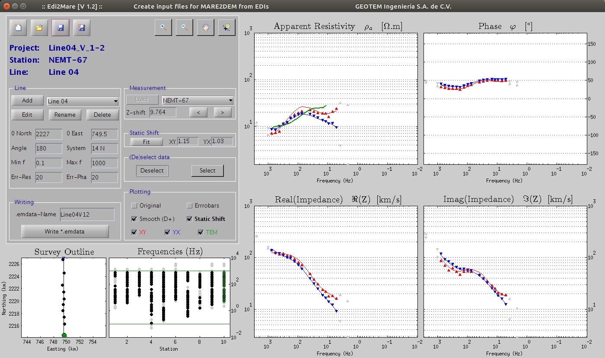

# Edi2Mare

`Edi2Mare` is a little GUI to help you to convert EDI-files into the correct
format to run inversions with `MARE2DEM`. So far it has only be used with
files created with `ProcMT` and with `WinGLink`.

1. `MARE2DEM` is a parallel adaptive finite element code for 2D forward and
   inverse modeling for electromagnetic geophysics. It was developed with
   funding support from the Scripps Seafloor Electromagnetic Methods
   Consortium, <http://mare2dem.ucsd.edu>.
2. `ProcMT` is free and open-source software to process MT data, provided by
   Metronix Geophysics, <http://geo-metronix.de>.
3. `WinGLink` is a multidisciplinary software program developed to process,
   interpret and integrate several geophysical disciplines in a unique
   interpretation model, <http://www.slb.com>.

## Summary

With `Edi2Mare` you can:

* Prepare `*.edi`-files for `Mamba2D` and `MARE2DEM`.
* Use `*.tem`-files to correct for *static shift*.
* You can use `*.wln`-files, exported from *WinGLink*, instead of `*.edi`-files 
* `Edi2Mare` will create the file `*.emdata`, which can subsequently be loaded
  with `Mamba2D`.

## Some warnings:

1. `Edi2Mare` was programmed in the Linux-version of `Matlab R2012b`. It was
   not tested outside this environment (not with other versions of `Matlab` nor
   on Windows/Mac).
2. `Edi2Mare` was created to solve a problem. However, there is lots of room
   for improvements. If you find `Edi2Mare` useful, and have the time to
   improve the code, then please go ahead!
3. `Edi2Mare` was only tested with `*.edi`-files from `ProcMT`, and
   `*.wln`-files from `WinGLink`.

## Edi2Mare
jith `Edi2Mare` you can:

* Read `*.edi`- or `*.wln`-files, and `*.tem`-files.
* Adjust the altitude of the receivers, *Z-shift* (`MARE2DEM` requires that all
  receivers are in the subsurface).
* Correct for the *Static Shift* by using *TEM*-data; automatic estimation is
  possible.
* Define the inversion-line (0-point and angle) and select the receivers for
  this line.
* Select a frequency-band, that goes into the inversion.
* Deselect bad data-points.
* Define error-levels.
* Show Robert L. Parkers D+ approximation.
* Write the data to `*.emdata` for `MARE2DEM`.

## User interface

I believe the `Edi2Mare` is simple enough that it does not require lots of
information. A few notes:

* Installation: Just copy the whole repo to your computer, and add the path to
  your `MATLAB`-paths.
* To start `Edi2Mare`, just execute `Edi2Mare` in the `MATLAB` command line.
* Many elements will show additional information if you hoover over them with
  your mouse.
* To start, you have to click on `Load` in the section `Measurement`. There you
  can choose the folder where you have the `*.edi`- or `*.wln`-files, and
  optionally the `*.tem`-files.

  **Important points:**
  1. In the data-folder you need a file `coordinates.txt`. The format of this
     file is:

     > Nombre        Easting         Northing      Altitude

     For instance:

     > 10_MT-1       749570.000      2224523.000      1620.125
     > 11_MT-2       747507.000      2223857.000      1565.855
     > 12_MT-3       745604.000      2224368.000      1526.000
     > 13_MT-Test    755432.000      2222445.000      1795.514

  2. The names of the `*.edi`-, `*.wln`-, and `*.tem`-files and the names of
     `coordinates.txt` have to start with the same 2-digit number, for instance:

     * `13_mt_auto_processing_median.edi`
     * `13_NETEM.tem`
     * `coordinates.txt`
       > 13_MT-Test     755432.000      2222445.000    1795.514

     The part following the number (`##_`) in the names of `coordinates.txt`
     is used to name the receivers; in the example the used name for that
     receiver would be `MT-Test`.
     These names an the file-names may not contain spaces.
* Z-Shift is positive facing downwards (convention from `MARE2DEM`).
* The automatic *Fit* for the *Static Shift* is just a suggestion, not
  necessarily the best values; it is a minimization between MT and TEM data.
* North and East are given in kilometers in `Edi2Mare`.
* The angle of the inversion-line is counterclockwise, in degrees.
* The *System* is for instance `14 N`, the UTM Coordinate System.
* The errors are in %.

## `Edi2Mare` with data exported from `WinGLink`.

The idea of `Edi2Mare` was to create the file `*.emdata` for `MARE2DEM` from
`*.edi`-files created from `ProcMT`. If you have MT data in WinGLink, there is
a possibility to use them for `Edi2Mare` too.: You have to export the MT data
as `*.wln`-files: Open the data in `WinGLink` => `Soundings`, and then `Files`
=> `Edit data ...` => `File` => `Export to File...` and save them with the
ending `.wln`.  (Exporting `*.edi`-files does not work, because then you would
export the original file, without the changes you made in `WinGLink`.)

The functionality of `Edi2Mare` is limited, if you use `*.wln`-files instead
of `*.edi`-files. You only see *Apparent Resistivity* and *Phase*, no
*Impedances*. D+ does not work either. However, it still works to create
the `*.emdata`-file and subsequently run an inversion with `MARE2DEM`.

